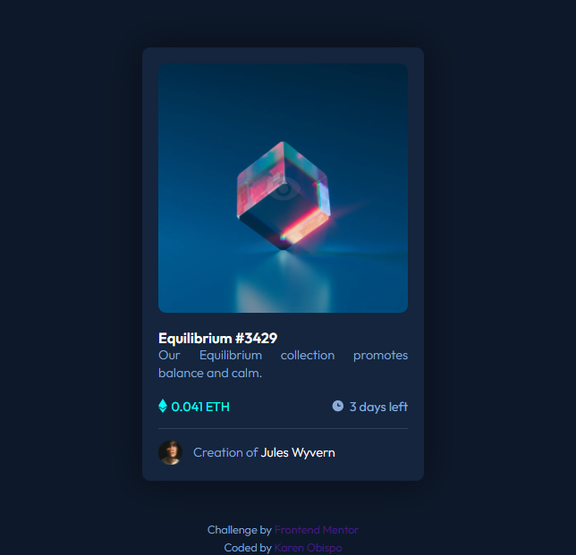

# Frontend Mentor - Stats preview card component solution
## Welcome! 👋

This is a solution to the [Interactive comments section challenge on Frontend Mentor](https://www.frontendmentor.io/challenges/nft-preview-card-component-SbdUL_w0U). Frontend Mentor challenges help you improve your coding skills by building realistic projects. 

## Table of contents

- [Overview](#overview)
  - [The challenge](#the-challenge)
  - [Screenshot](#screenshot)
  - [Links](#links)
- [My process](#my-process)
  - [Built with](#built-with)
  - [What I learned](#what-i-learned)
  - [Useful resources](#useful-resources)
- [Author](#author)

## Overview

### The challenge

Users should be able to:

- View the optimal layout depending on their device's screen size

### Screenshot

Add a screenshot of my solution. 

### Links

- Solution URL: [Add solution URL here](https://github.com/sskaren1/stats-preview-card-component.git)
- Live Site URL: [Add live site URL here](https://sk1-stats-preview-card.netlify.app)

## My process

### Built with
- HTML5 markup
- CSS custom properties
- Flexbox
- SASS
- Mobile-first workflow
- Responsive layout

### What I learned

I learned to use CSS to give the components a design, I also learned to use flex to be able to position the elements.

### Useful resources

- [W3Schools Online Web Tutorials](https://www.w3schools.com/) - This is an amazing website for learning coding online.
- [MDN Web Docs](https://developer.mozilla.org/es/) - This is an amazing documentation repository and learning resource for web developers.
- [Stackoverflow](https://stackoverflow.com/) - This site helped me get answers to problems I had while doing this project.

## Author

- Frontend Mentor - [@sskaren1](https://www.frontendmentor.io/profile/sskaren1)
- GitHub - [@sskaren1](https://github.com/sskaren1)
